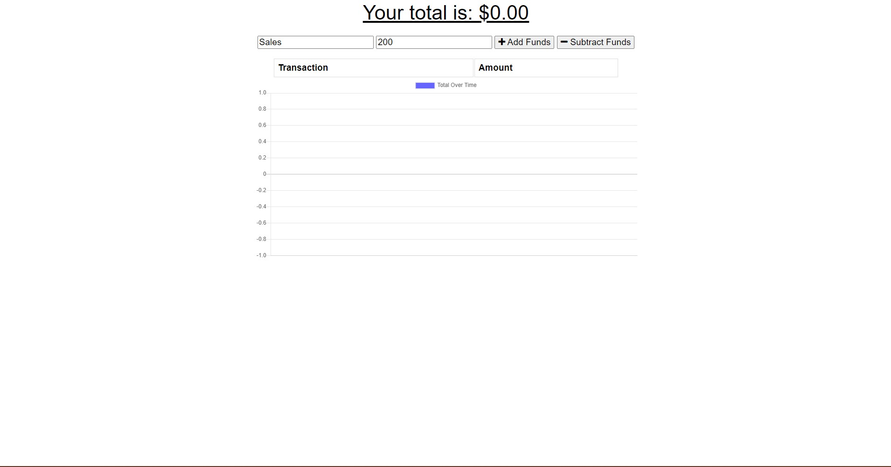
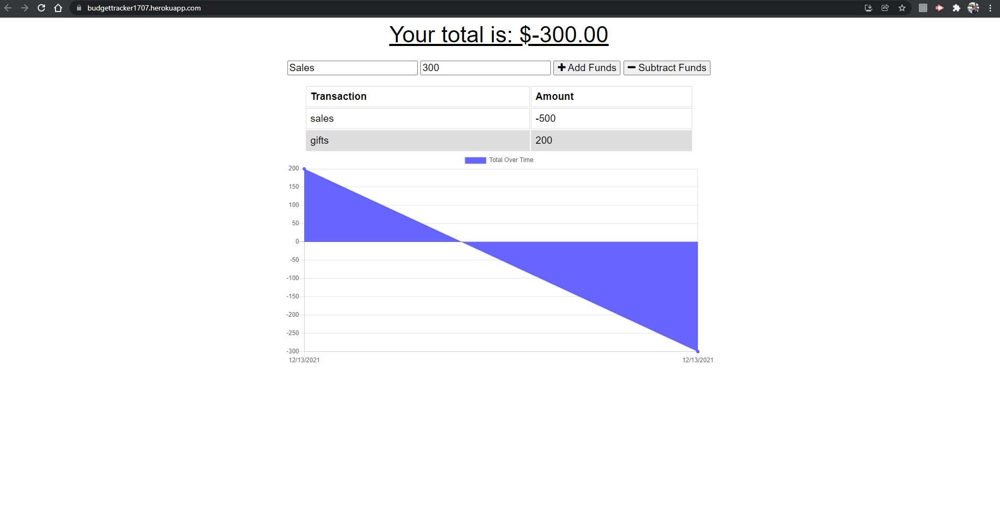
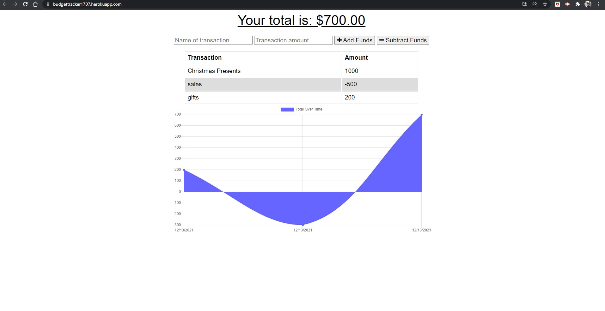

# BUDGET_TRACKER

### Table of Contents

- [Desciption](#description)
- [Contributors](#contributors)
- [Installation](#installation)
- [Technologies_Used](#technologies_used)
- [Media](#media)

## Description:

Budget Tracker is an offline budget tracker that allows you to cache data and update once you go back online. The application will save your data, allow you to access specific cached information, and update all cached data once it restores connection.

### Contributors

Alfonso Robles

#### Installation

- `npm install`
- `npm start`
- 'npm webpack-cli'
- 'npm webpack-pwa-manifest'

#### Technologies_Used

- MongoDB
- Express
- Morgan

#### Media

[BudgetTracker](https://budgettracker1707.herokuapp.com/)

